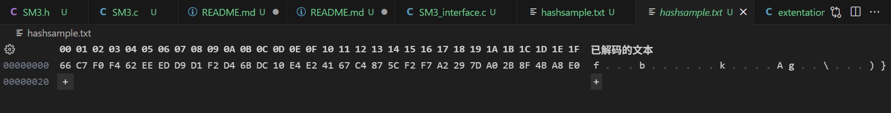
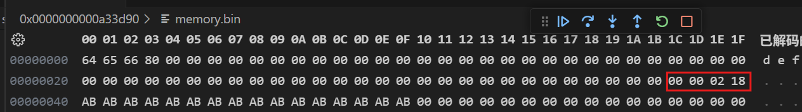

# Project 4: SM3的软件实现与优化

## project要求

a）：与Project 1类似，从SM3的基本软件实现出发，参考付勇老师的PPT，不断对SM3的软件执行效率进行改进
b）：基于sm3的实现，验证length-extension attack
c）：基于sm3的实现，根据RFC6962构建Merkle树（10w叶子节点），并构建叶子的存在性证明和不存在性证明（暂未实现）

## 快速开始

### SM3算法使用

本项目实现了SM3算法，你可以通过观察文件 `./SM3_basic.c`、`./SM3.c`、`SM3_interface.c`三个文件来观察SM3的实现。同时SM3算法已经编译成了exe可执行文件：`SM3.exe`。你可以通过一下命令来使用它：

```
./SM3.exe {input.txt} {output.txt}
```

项目中提供了一个示例，你可以通过如下具体的命令对示例做一次hash：

```
./SM3.exe ./sample.txt ./hashsample.txt 
```

示例文件 `sample.txt`中写的是SM3国密标准文档中的示例1，即字符串:`abc`。在hash后，你可以使用十六进制编辑器来观察hash值。本项目已经经过了验证，做出的hash值与[SM3国密标准文档](https://oscca.gov.cn/sca/xxgk/2010-12/17/1002389/files/302a3ada057c4a73830536d03e683110.pdf)中对应示例的hash值相同：




你也可以继续验证文档中的第二个示例，同样的也经过了验证，这里不再赘述。

PS：本project是在VScode编辑器上开发的，如果你也有VScode，可以通过VScode查看编译运行脚本:`./.vscode/launch.json`、`./.vscode/tasks.json`帮助理解整个项目的构建过程。

### SM3算法的length-extension attack攻击验证

这一部分可以观察文件 `./extentation_att.c`。由于任务是验证，所以你可以通过结合代码和讲解一并理解。后续我会对攻击原理以及实现过程做详细阐述。

### Merkle树验证

由于工业界的Merkle树有些复杂，我没有时间实现一个完整的工业化的Merkle树了，所以实现了一个演示性的代码。有关Merkle树的实现在路径 `./Merkle_Tree`下，你可以查看这个链接：[Merkle_Tree\README.md](Merkle_Tree\README.md)

## 源码介绍

所有的实现均基于SM3国密手册进行：[302a3ada057c4a73830536d03e683110.pdf (oscca.gov.cn)](https://oscca.gov.cn/sca/xxgk/2010-12/17/1002389/files/302a3ada057c4a73830536d03e683110.pdf)

算法的底层写在文件 `./SM3_basic.c` 和它的头文件 ` ./SM3_basic.h`中，包括定义循环左移函数，初始值，常量，布尔函数，置换函数。

在此之上构建出了SM3算法的上层实现，在文件 `./SM3.c`和 `./SM3.h`中，我们定义了填充函数，消息扩展函数以及压缩函数:

```c
byte* padding(byte *message, uint64_t bit_length);
void message_extend(word *W1,word *W2,word B[16]);
void CF(word V[8],word B_list[16]);
```

最终所有的功能函数都在函数 `word*SM3( byte*message, size_t bit_len)`中使用，这个函数是SM3算法实现的最顶层函数，它接受一个message指针以及指示该message有多长bit位的bit_len值，最终会返回一个指向堆中256bit的内存，其中存放了hash值。

同时我们也定义了一个 `SM3_attack`函数，这个函数是 `SM3`函数的变种，从名字上也知道这是一个服务于攻击的函数，它可以强制指定输入的初始IV，和padding过程中填充到字符末尾的长度值。至于这样设计的原因在后续讲解攻击原理的时候详细展开。

在文件 `./SM3_interface.c`中定义了一个main函数，这是SM3算法的功能接口。定义了它的命令行格式（当然只定义了一种命令格式（doge））。

在实施攻击的文件 `./extentation_att.c`中也定义了一个main函数，这个函数内部主要是演示作用。

### 实现中的大小端问题

大小端问题是一个在实现加密以及哈希等算法时很容易忽视的点。在国密标准手册中，所有的数字都是以人类易懂的大端形式写的，但是目前很多的计算机架构都是小端存储，如果不重视这一点，就会导致异或过程中出现大端数据和小端数据异或的错误，最终导致算法错误。

我可以举一个例子来帮助你理解大小端不统一所带来的问题，现在，假设左边为低地址，右边为高地址。你设定了一个数组来读取存储在文件中的数据：

```c
uint8_t msg[]={0x01,0x23,0x45,0x67,0x89,0xab,0xcd,0xef,0xfe,0xdc,0xba,0x98,0x76,0x54,0x32,0x10};
```

那么在内存中这段数据就是这么排布的：

```c
低地址	0x0123456789abcdeffedcba9876543210	高地址
```

同样的，你会定义常量，比如：

```c
const word T0_15=0x79cc4519;
```

它在内存中的布局为：

```c
低地址	0x1945cc79	高地址
```

这时候，如果常量对数据进行操作，比如对前四个字节进行异或，那么就会变成：

```c
低地址	0x01234567 ^0x1945cc79 	高地址
```

这时候就出现了大小端不匹配问题，即我们输入的数据是按照大端存储的，但是计算机中存储的数据却是按照小端存储的，整个数据都反了。

那么有什么解决办法吗？也很简单，我们将数据在输入时做一次大小端调换，将它变成小端从而与计算机匹配，然后在做完hash后将输出的hash值再做一次大小端调换，就可以将hash从小端重新变回大端了。当然还有一个问题，我们该做大小端调换调换的是多长的数据？重新观察算法实现指导，你会发现基本上所有的异或移位操作等都是基于32bit，即字为单位的，所以只需对每32bit的数据做大小端调换即可。关于大小端调换的函数以内联函数的方式定义在了文件 `./SM3_basic.h`中：

```c
// 字节序转换 (主机序 <-> 大端序)
static inline uint32_t to_big_endian(uint32_t val) {
    return ((val << 24) | ((val << 8) & 0x00FF0000) |
           ((val >> 8) & 0x0000FF00) | (val >> 24));
}
```

这个函数在文件 `./SM3.c`中的 `SM3( byte*message, size_tbit_len)`函数中使用。

## 性能优化

对于SM3的优化我在网上搜集过一段时间的资料，目前存在的对于SM3算法的优化思路无非就是玩编程语言的文字游戏以及定制硬件实现，前者并不能达到像SM4的AESNI指令优化那样的巧妙和性能上的大幅提升，后者就需要牵扯到数字电路实现方面的知识，显然偏离了本project的方向，外加使用C与语言实现性能已经可以达到一个比较好的成都了，所以本project并没有在优化上更进一步。如果有人实现了SM3算法的优化并达到一个很好的效果，可以给我留言，感激不尽。

## length-extension attack攻击原理讲解

貌似哈希算法都容易出现这种攻击，攻击原理是由算法本身的流程所决定的，我们都知道，SM3会把输入数据 `B`分割并填充成512bit大小的块，然后他会逐个块进行处理，假设当前的512bit的块是 `B[i]`，那么它会接受一个256bit的向量 `V[i]`，然后生成一个新的256bit的向量 `V[i+1]`.这就是压缩函数 `CF`的功能，我们可以用一下式子表示：

```c
V[i+1]=CF(V[i],B[i]);
```

其中，`V[i]`是前一个 `CF`函数输出的hash值，`V[0]`是初始向量IV。

假设受害者有一个 `secret`字符串，我们无法得知 `secret`具体信息是什么，但我们能粗略的估计出 `secret`的长度 `secret_len`，并获得它的hash值 `secret_hash`。那么理论上我们就可以继续调用CF函数，将 `secret_hash`作为V[i]，我们可以任意构造任意长度的B[i]，通过CF函数获得V[i+1]，我们就可以说，这个V[i+1]即为消息：`secret+padding+our_message+our_padding`做出的hash值，即便我们不知道 `secret`具体什么。

我可以通过代码做一个演示，在文件 `./extentation_att.c`中。假设受害者的secret是一个 `abc`字符串，它的hash值存储在 `result`中：

```c
//construct secret :we dont know it's abc ,but we can know how many 512bit block it has.
    byte secret[]= "abc";
    byte* result=(byte *)SM3(secret, 24);
    printf("secret message is: abc\n");
    printf("SM3(\"abc\") = \n");
    for (int i = 0; i < 32; i++) 
        printf("%x",*(result+i) );
    printf("\n");
```

现在，作为攻击者，我们不知道secret的值，但我们知道secret有多少个512bit块。我们自己构造一个消息 `message`，它是字符串 `def`。通过调用 `SM3_attack`函数，我们可以强制设置调用CF函数的IV为 `secret`的哈希值 `reesult`，并将填充步骤的长度设置为 `512*secret的512bit块数+我们构造的message的bit长度`，即为：512+24：

```c
 //construct message,define message_length= secret_length+message_length
    //this message length is we constructed.
    byte message[]="def";
    size_t message_len=512+24;

    //attack force set the message length in padding and the IV.
    byte* result1=(byte *)SM3_attack(message, 24,(word *)result,message_len);
    printf("secret message is: def\n");
    printf("SM3(\"def\") = \n");
    //now we can confrim the constructed m' :secret+secret_padding+message 's hash is below
    for (int i = 0; i < 32; i++) 
        printf("%x",*(result1+i) );
    printf("\n");
```

通过填充后的message变量长这样：



现在，我们可以说求得的 `result1`就是 `secret+secret_padding+message`的哈希值了。可以手动构建一个消息 `secret+secret_padding+message`过一遍SM3进行验证：

```c
//vertify
    byte * message_padding=padding(secret,24);
    byte *secret_padding_message=malloc(64*sizeof(byte)+3);
    memcpy(secret_padding_message,message_padding,64);
    memcpy(secret_padding_message+64,message,3);
    byte* result2=(byte *)SM3(secret_padding_message, message_len);
    printf("SM3(\"abc+padding+def\") = \n");
    for (int i = 0; i < 32; i++) 
        printf("%x",*(result2+i) );
    printf("\n");
```

最终你应该会在终端看到：

```c
secret message is: abc
SM3("abc") =
66c7f0f462eeedd9d1f2d46bdc10e4e24167c4875cf2f7a2297da02b8f4ba8e0
secret message is: def
SM3("def") =
db971139b8ccc58335a1e3702441daaf9fd32b42db157ce4bf745ad6fb95ac48
SM3("abc+padding+def") = 
db971139b8ccc58335a1e3702441daaf9fd32b42db157ce4bf745ad6fb95ac48
```

比对第二个和第三个hash值，你会发现我们构造的消息可以成功伪造hash。
